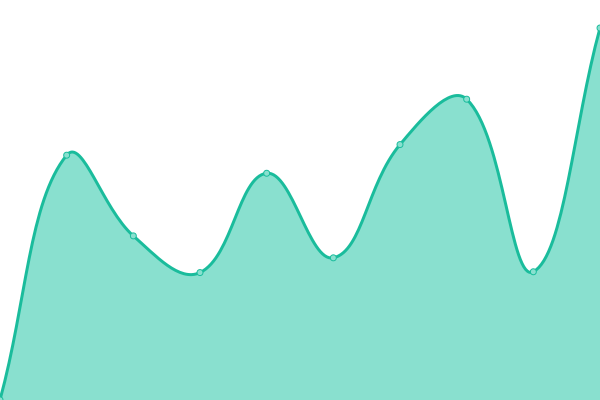
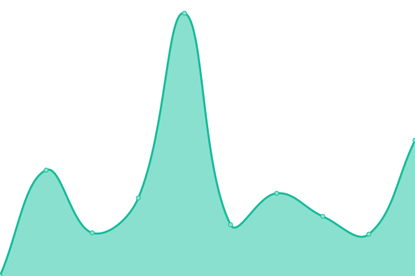

# [📈 Live Status](https://PRAVNA-Group.github.io/risify-upptime): <!--live status--> **🟩 All systems operational**

This repository contains the open-source uptime monitor and status page for [PRAVNA Group](https://pravna.pl), powered by [Upptime](https://github.com/upptime/upptime).

With [Upptime](https://upptime.js.org), you can get your own unlimited and free uptime monitor and status page, powered entirely by a GitHub repository. We use [Issues](https://github.com/PRAVNA-Group/risify-upptime/issues) as incident reports, [Actions](https://github.com/PRAVNA-Group/risify-upptime/actions) as uptime monitors, and [Pages](https://PRAVNA-Group.github.io/risify-upptime) for the status page.

<!--start: status pages-->
<!-- This summary is generated by Upptime (https://github.com/upptime/upptime) -->
<!-- Do not edit this manually, your changes will be overwritten -->
<!-- prettier-ignore -->
| URL | Status | History | Response Time | Uptime |
| --- | ------ | ------- | ------------- | ------ |
|  [Risify App [PL]](https://panel.risify.pl) | 🟩 Up | [risify-app-pl.yml](https://github.com/PRAVNA-Group/risify-upptime/commits/HEAD/history/risify-app-pl.yml) | 

 1995ms
     
 | 

<a href="https://PRAVNA-Group.github.io/risify-upptime/history/risify-app-pl">98.94%</a>
    

|  [Risify API](https://api.panel.risify.pl/v1/test) | 🟩 Up | [risify-api.yml](https://github.com/PRAVNA-Group/risify-upptime/commits/HEAD/history/risify-api.yml) | 

 1038ms
     
 | 

<a href="https://PRAVNA-Group.github.io/risify-upptime/history/risify-api">98.94%</a>
    

|  [Risify Documents](https://documents.risify.pl) | 🟩 Up | [risify-documents.yml](https://github.com/PRAVNA-Group/risify-upptime/commits/HEAD/history/risify-documents.yml) | 

 1045ms
     
 | 

<a href="https://PRAVNA-Group.github.io/risify-upptime/history/risify-documents">98.94%</a>
    

|  [Risify Assets](https://assets.risify.pl/img/risify-logo-email-19092023.png) | 🟩 Up | [risify-assets.yml](https://github.com/PRAVNA-Group/risify-upptime/commits/HEAD/history/risify-assets.yml) | 

 868ms
     
 | 

<a href="https://PRAVNA-Group.github.io/risify-upptime/history/risify-assets">98.94%</a>
    

<!--end: status pages-->

[**Visit our status website →**](https://PRAVNA-Group.github.io/risify-upptime)

## 📄 License

- Powered by: [Upptime](https://github.com/upptime/upptime)
- Code: [MIT](./LICENSE) © [Anand Chowdhary](https://anandchowdhary.com), supported by [Pabio](https://pabio.com)
- Data in the `./history` directory: [Open Database License](https://opendatacommons.org/licenses/odbl/1-0/)
